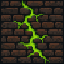

# Plague

Plague is a shaderpack: a description of how a Minecraft world should be lit and drawn. It does not
render anything itself. It is a folder of GLSL and plain-text TOML that the
[Fornax](https://github.com/Icehunter/fornax) engine reads and runs: the TOML declares the render
passes, the targets they draw into, the options the player can change, and the settings screen those
options appear on.

The look it aims for is physically motivated light: time of day, real sources, and bounces, at the
best framerate that allows. Deferred shading with labPBR materials, screen-space reflections,
volumetric clouds and water, a procedural sky, and an underwater treatment that models the water
column rather than tinting the screen blue.

**The pack format is Fornax's own.** It is not compatible with packs written for other loaders, and
they are not compatible with it.

## Requirements

- [Fornax](https://github.com/Icehunter/fornax), and everything it requires: Minecraft 26.2,
  Fabric Loader ≥ 0.19.2, Sodium 0.9.1 or 0.9.2, and Java 25 or newer.
- A GPU that can carry a deferred pipeline with volumetrics. Most settings have a quality tier, and
  the heaviest features can be turned off individually.

## Installing

Put this folder (or a zip of it) in `shaderpacks/` and select it in game. Everything is adjustable
from the pack's own settings screens; nothing needs editing by hand.

## What it does

[docs/FEATURES.md](docs/FEATURES.md) lists what currently works, verified against the graph and the
shader tree rather than from memory. [docs/KNOWN-ISSUES.md](docs/KNOWN-ISSUES.md) is the honest other
half.

## How it is built

[docs/ARCHITECTURE.md](docs/ARCHITECTURE.md) describes the render graph: the passes, what each one
reads and writes, and why they run in that order.

The four TOML files at the root are the pack's contract with the engine:

| file | declares |
|---|---|
| `pack.toml` | identity: name, version, licence, format |
| `graph.toml` | the render graph: passes, targets, textures |
| `screens.toml` | the settings screens and what appears on them |
| `blocks.toml` | material categories. Exactly one, deliberately |

Constant tables are generated, not typed: `tools/derive_*.py` and `tools/generate_foam.py` emit the
numbers the shaders use. Rerun one and you get what ships.

## Licence

MIT, see [LICENSE](LICENSE). Third-party code is listed in
[THIRD-PARTY-NOTICES.md](THIRD-PARTY-NOTICES.md) with its licence text, and every binary that ships
has a row in [ASSETS.md](ASSETS.md).
